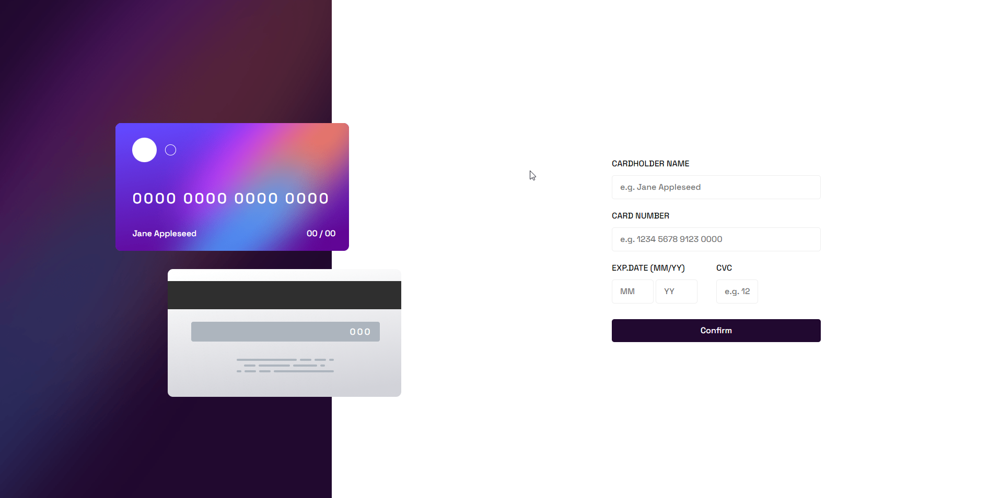
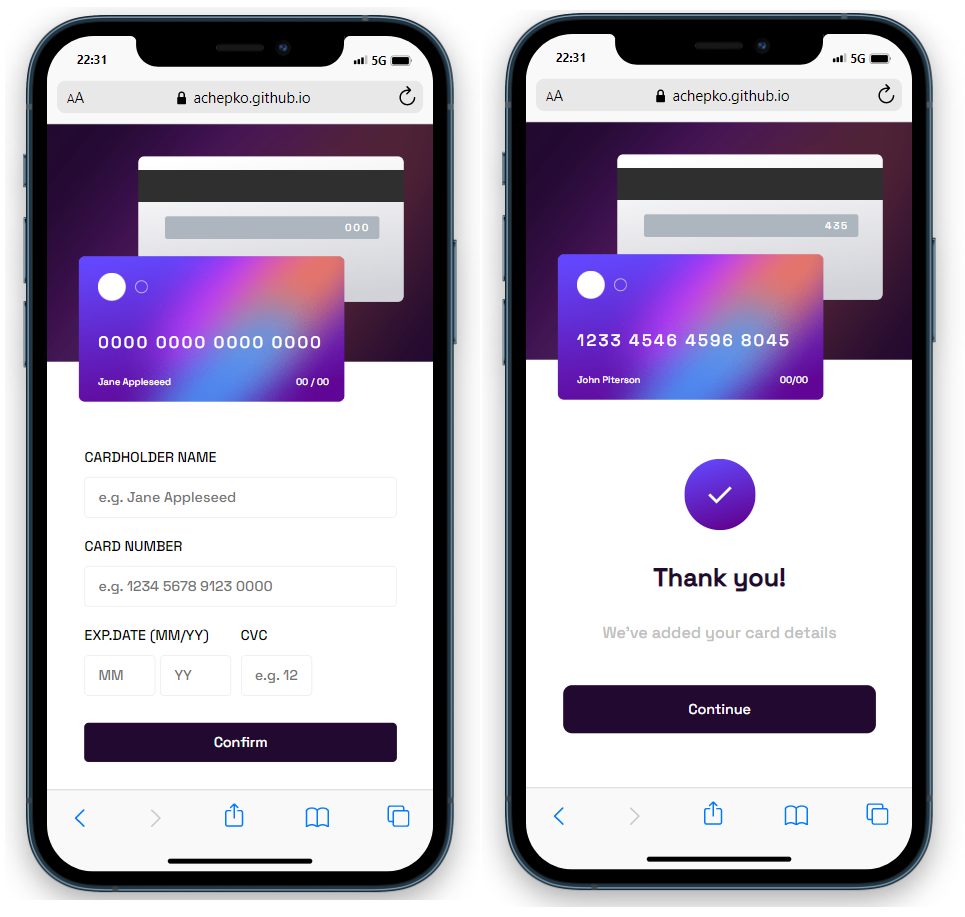

# Frontend Mentor - Interactive card form solution

This is a solution to the [QR code component solution challenge on Frontend Mentor](https://www.frontendmentor.io/challenges/interactive-card-details-form-XpS8cKZDWw).

## Table of contents

- [Frontend Mentor - Interactive card form solution](#frontend-mentor---interactive-card-form-solution-solution)
  - [Table of contents](#table-of-contents)
  - [Overview](#overview)
    - [The challenge](#the-challenge)
    - [Screenshot](#screenshot)
    - [Links](#links)
  - [My process](#my-process)
    - [Built with](#built-with)
    - [What I learned](#what-i-learned)
    - [Useful resources](#useful-resources)
  - [Author](#author)

## Overview

### The challenge

Users should be able to:

- View the optimal layout depending on their device's screen size
- See hover and focus states for interactive elements

### Screenshot

### Links

- Solution URL: [Solution](https://github.com/achepko/P3_Interactive-card-details-form)
- Live Site URL: [Live](https://achepko.github.io/P3_Interactive-card-details-form/)

## My process

### Built with

- Semantic HTML5 markup
- CSS custom properties
- Flexbox
- IntelliJ IDEA 2022.3

### Useful resources

- [Flexbox](https://developer.mozilla.org/en-US/docs/Web/CSS/CSS_Flexible_Box_Layout/Basic_Concepts_of_Flexbox) - Basic concepts of flexbox

## Author
- Frontend Mentor - [@achepko](https://www.frontendmentor.io/profile/achepko)

